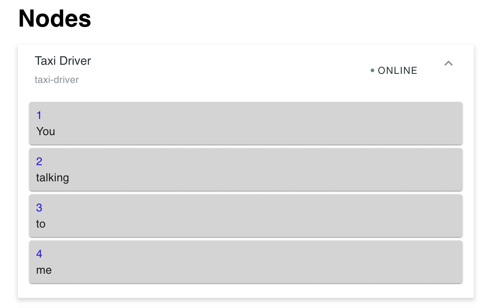
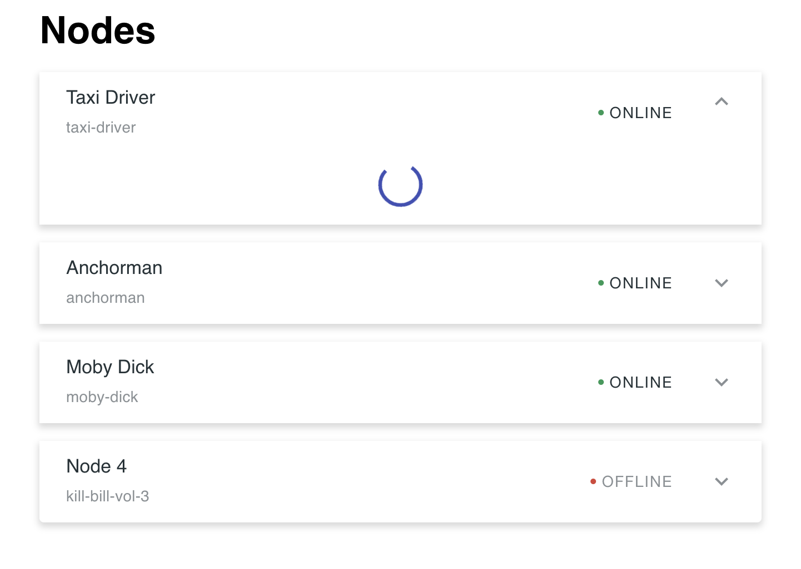
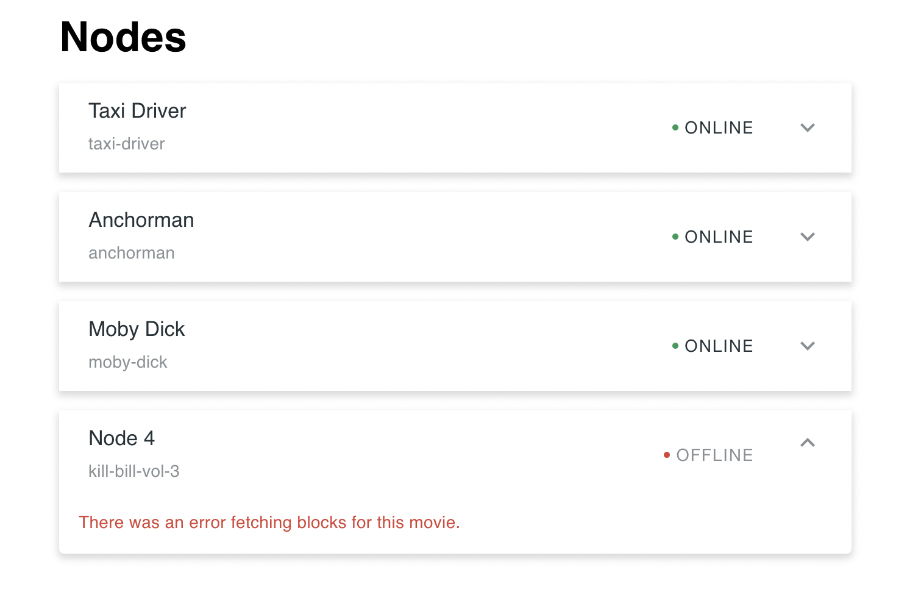
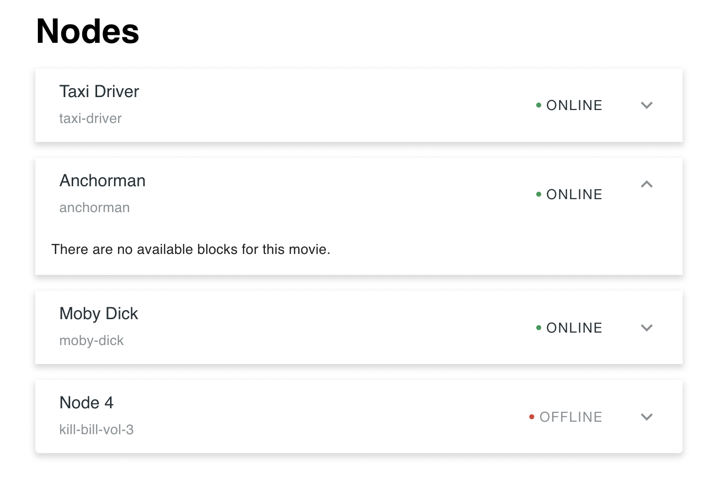

# Movie Quotes

## Installation

1. `unzip repo`
2. `cd movie-quotes`
3. `nvm use`
4. `cd ./server && npm i`
5. `cd ../client && npm i`
6. `cd .. && npm start`
7. `npm test`

## Demo
1) Happy path, displays blocks

2) Loading

3) Error fetching blocks

4) No blocks available

