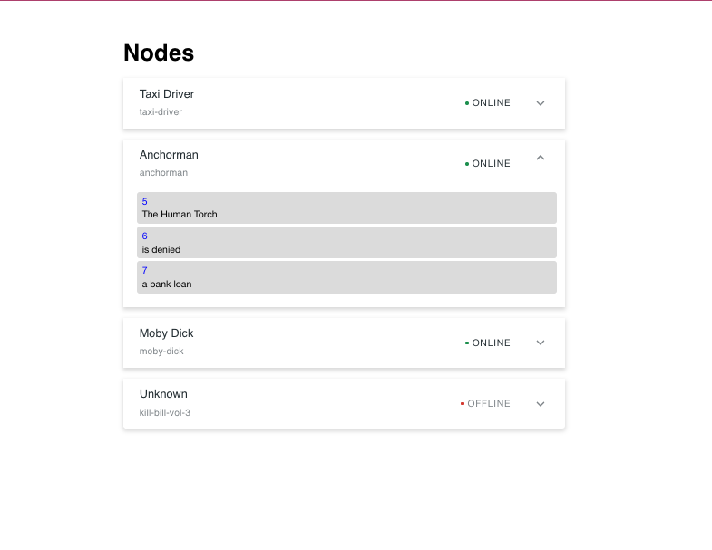

# Movie Quotes

## Installation

1. `unzip repo`
2. `cd movie-quotes`
3. `nvm use`
4. `cd ./server && npm i`
5. `cd ../client && npm i`
6. `cd .. && npm start`
7. `npm test`

## Instructions

Create a new public GitHub repo, then add descriptive commits as you go. When complete, email a link to the repo to careers@colossal.com.

The current application is displaying a list of Nodes. Each Node represents a movie, and has many Blocks, which come together to form a quote from that movie. Each node has an id. Each id can be passed to the same API but returns different data. The important endpoints you will need to know for each server are:
/api/:id/
/api/:id/blocks

Each node has many blocks and the blocks for each node are returned from the blocks endpoint.

Currently the application is getting the title for each node and updating the state. We would like you to retrieve the blocks from the endpoint, place them in the state and render them into a list that matches the design shown below 

## Acceptance criteria:
1. Blocks are displayed when opening up the card
2. Loading, error, empty states are displayed when appropriate
3. Implementation matches the design
4. Components are created in a reusable manner
